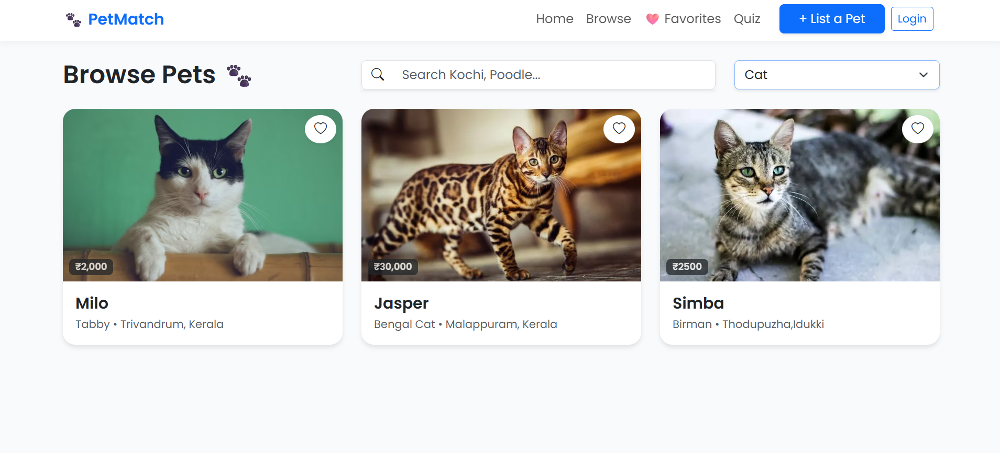
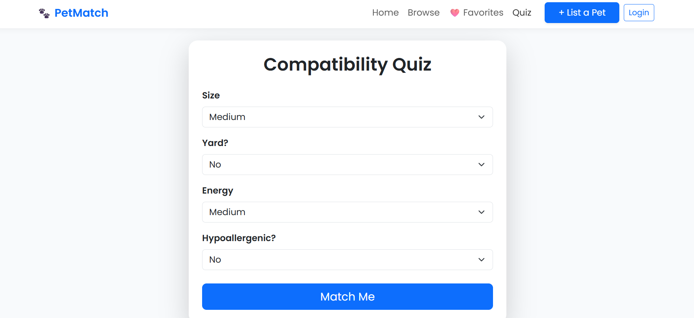
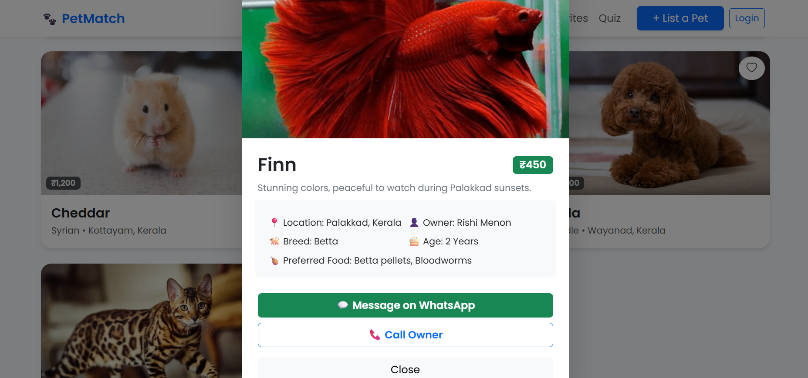

# 🐾 PetMatch 🎯

---

## Basic Details

### Team Name:
CodePals

### Team Members
- Member 1: Selda Treesa Jose – Mar Athansius College of Engineering
- Member 2: Christina Manjila – Mar Athansius College of Engineering

---

### Hosted Project Link
https://selda-treesa-jose.github.io/petmatch-web/

---

## Project Description
PetMatch is a smart pet adoption platform that helps users discover pets, understand them through owner-provided details, and find compatible companions using a quiz-based matching system.

The platform creates a shared adoption space focused on connection, trust, and informed decision-making.

---

## The Problem Statement
Pet adoption platforms often act only as listing boards where adopters cannot properly understand pets before adoption. This causes poor compatibility, lack of trust, and unsuccessful adoptions.

---

## The Solution
PetMatch provides a centralized platform where adopters can browse pets, learn about them directly from owners, and use a compatibility quiz to find suitable matches, making adoption more personal and reliable.

---

## Technical Details

### Technologies/Components Used

#### For Software:

**Languages used**
- HTML5
- CSS3
- JavaScript

**Frameworks used**
- Bootstrap 5

**Libraries used**
- Bootstrap Icons
- Google Fonts

**Tools used**
- VS Code
- Git & GitHub
- Browser Developer Tools

---

## Features

- Feature 1: Browse pets with search and filtering options
- Feature 2: Compatibility quiz for personalized pet matching
- Feature 3: Favorites system to save preferred pets
- Feature 4: Pet listing system for owners
- Feature 5: LocalStorage-based authentication system
- Feature 6: Responsive modern UI

---

## Implementation

### For Software

#### Installation

No installation required.

#### Run

Open the project locally:

```
index.html
```

in any modern web browser.

---

## Project Documentation

### For Software

#### Screenshots (Add at least 3)


Home page showing featured pets and landing interface.


Browse pets page with filtering and search functionality.


Compatibility quiz used to match users with suitable pets.



Pet details modal showing owner information and pet description.
---

### Diagrams

#### System Architecture

Frontend web application built using HTML, CSS, Bootstrap, and JavaScript.  
User interactions are handled in JavaScript while LocalStorage manages authentication and session data.

#### Application Workflow

User → Login → Browse Pets → Take Quiz → View Matches → Save Favorites → List Pet

---

## Additional Documentation

### For Web Projects with Backend
(Not Applicable – Frontend-only project using LocalStorage)

---

## Project Demo

### Video
(Add your demo video link here)

Example:
https://youtube.com/demo-link

The video demonstrates browsing pets, taking the quiz, saving favorites, and listing pets for adoption.

---

### Additional Demos
Live Demo Link: https://your-live-project-link.com

---

## AI Tools Used (Optional - For Transparency Bonus)

**Tool Used:** ChatGPT

**Purpose:**
- Debugging assistance
- README documentation formatting
- UI improvement suggestions

**Key Prompts Used**
- "Create a responsive pet adoption UI"
- "Improve JavaScript filtering logic"
- "Generate hackathon README structure"

**Percentage of AI-generated code:** ~20%

**Human Contributions**
- Project idea and planning
- UI design decisions
- Feature implementation
- Testing and integration

---

## Team Contributions

- Selda Treesa Jose: Backend development, documentation, Authentication and quiz logic
- Christina Manjila: Frontend development, testing, UI design

---

## License

This project is licensed under the MIT License.

---

## ❤️ Built for Tink-Her-Hack
PetMatch promotes responsible adoption by improving communication, compatibility, and trust between pet owners and adopters.
